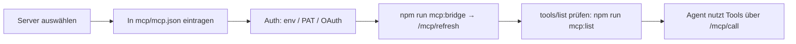

# 🔌 MCP-Integration — `mcp-mobile-server`, Bridge, Catalogue

** installiert:** GitHub-Projekt [`cristianoaredes/mcp-mobile-server`](https://github.com/cristianoaredes/mcp-mobile-server)
als npm-Paket `@cristianoaredes/mcp-mobile-server@2.3.0` (MIT, Node ≥ 18, Transport **stdio / JSON-RPC 2.0**),
verlinkt über `mcp/mcp.json`. Es wurde **kein LobeChat geklont** — die dortigen Fähigkeiten
(Agenten-Galerie, Live-Dashboard, RAG, MCP-Verwaltung) sind nativ in diese App portiert.

```bash
npm install @cristianoaredes/mcp-mobile-server   # erledigt (steht in package.json → dependencies)
npm run mcp:bridge                               # Bridge auf :8790 (stdio-MCP + Gateway-Proxy + Metrics)
npm run mcp:list                                 # Tools katalogisieren (initialisieren + tools/list)
npm run mcp:start                                # MCP-Server allein im Stdio-Modus (für Claude Desktop/Cursor)
```

## 1️⃣ Warum eine Bridge?

Der MCP-Server spricht **stdio** — Browser und Capacitor-WebView können keine Pipes öffnen.
`mcp/bridge.mjs` (bewusst **ohne** npm-Dependencies, nur Node-Bordmittel, läuft damit auch auf
RPi Zero 2 W) macht daraus HTTP-Endpunkte und hängt gleichzeitig das Python-Gateway an:

```text
@cristianoaredes/mcp-mobile-server (stdio, 31 Tools)
        ▲  JSON-RPC 2.0 über stdin/stdout
        │
mcp/bridge.mjs  :8790 ──┬── GET  /mcp/health | /mcp/tools | /mcp/stats | /metrics
                        ├── POST /mcp/refresh | /mcp/call | /mcp/metrics/run | /mcp/http
                        ├── GET  /mcp/sse        (MCP-Streaming für externe Clients)
                        └── GET  /gateway/*  ───► Python-Gateway :8791 (CORS-frei im WebView)
        │
        ├── Web-App (Vite-Proxy für /mcp und /gateway, s. vite.config.ts)
        ├── Desktop-Konsole (desktop/utils/clients.py)
        └── Prometheus (Scrape-Job mcp-bridge)
```

Vite-Proxy + relative URLs ⇒ **im Client steht kein `localhost`**, die App bleibt Capacitor-fähig
und offline-tauglich. Fällt die Bridge aus, antworten alle UIs mit klarem Offline-Hinweis statt
Exception.

## 2️⃣ Endpunkte der Bridge

| Methode | Pfad | Zweck |
|---|---|---|
| `GET` | `/mcp/health` | `{ok, uptime, requests, cache{entries,hits}, mcp{connected,tools}, gateway{reachable}}` |
| `GET` | `/mcp/tools` | Katalog `[{name, description, inputSchema}]` |
| `POST` | `/mcp/refresh` | `tools/list` neu ziehen |
| `POST` | `/mcp/call` | `{tool, args, noCache?}` → `{ok, tool, ms, cached?, result \| error}` |
| `POST` | `/mcp/metrics/run` | Agent-Lauf melden (`ms, tokens, cost_usd, cache_hit, tools, status`) |
| `GET` | `/mcp/stats` | aggregierte Laufzeit-Metriken (Dashboard) |
| `GET` | `/metrics` | Prometheus-Textformat |
| `POST` | `/mcp/http` | MCP über Streamable-HTTP (externe Clients, LobeChat-Import) |
| `GET` | `/mcp/sse` | SSE-Kanal für MCP-Clients |
| `GET/POST` | `/gateway/*` | Proxy zum BLE-Gateway |

Cache: identicaler `(tool, args)`-Schlüssel wird **8 s** lang bedient (`cached: true`), sonst voller
Roundtrip. `noCache: true` erzwingt Frische. Antwortgrößen begrenzt, Timeout
`MCP_CALL_TIMEOUT_MS` (Default 180 s).

Env: `MCP_BRIDGE_PORT` · `GATEWAY_URL` · `MCP_MOBILE_SERVER_PKG` · `MCP_SERVER_BIN` · `MCP_CALL_TIMEOUT_MS`.

## 3️⃣ Was die App damit macht

- **`McpServerPanel`** (`src/components/McpServerPanel.tsx`): Live-Status, Tool-Suche, Einzelaufruf
  mit Formular aus der `inputSchema`, Kopier-block mit **der exakten `mcp.json`**, Bridge neu starten
  (über das `run_command`-Tool), Diagnose-Block mit Fix-Vorschlägen.
- **Agent-Intents** (`src/lib/agent/agentEngine.ts`): `mcp status`, `mcp tools <suche>`,
  `mcp call <tool> {json}`, `mcp verbinde` / `bridge neu`. Die Tools sind zusätzlich als Skills
  sichtbar (`mcp:*`-Präfix), damit das Reasoning sie im System-Prompt hat.
- **Desktop-Konsole** (`desktop/utils/clients.py` + `utils/agent.py`): dieselben Absichten als
  `mcp tools …`, `mcp tool=<name> k=v …`, `mcp verbinden` — reine Standardbibliothek (`urllib`),
  keine zusätzlichen Pakete, nie eine Exception bei Nichterreichbarkeit.
- **Live-Dashboard**: MCP-Fehlerquote/Latenz und Cache-Trefferquote stammen aus `/mcp/stats`
  (gemeinsame Quelle mit Prometheus → Web-Ansicht und Grafana zeigen dieselben Zahlen).

Beispiel aus der Konsole:

```text
> mcp tool=health_check verbose=true
✅ health_check (12 ms)
```json
{ "status": "ok", "platform": "linux", … }
```
```

## 3️⃣b PortView: Bridge-Port automatisch setzen

Wenn der Bridge-Port nicht 8790 ist (Container, Mehrfach-Instanzen, Handy im Werks-WLAN),
vermitteln Discovery und App: `GET /mcp/health` meldet `port` und `gateway_url`, die App
prüft den daraus abgeleiteten Gateway-Port mit einer eigenen Sonde nach und übernimmt nur
den Kandidaten mit der niedrigsten Latenz. UDP-Broadcast (`DGS_DISCOVER` → `:18791`) liefert
das Port-Triple direkt vom Gateway. Details, Umschalter und Grenzen:
[`docs/portview-import.md`](portview-import.md).

## 4️⃣ Empfohlener MCP-Katalog (Datenbanken & Co.)

Ausgewählt nach dem von dir genannten Zielbild (Datenhaltung, Workspace, Kaggle, GitHub).
`npm run mcp:list` zeigt, was lokal tatsächlich verfügbar ist; für die übrigen gilt der
Integrationspfad in §5.

| MCP-Server | Scope | Datenbanken / Systeme | Sicherheit |
|---|---|---|---|
| `@cristianoaredes/mcp-mobile-server` ✅ installiert | Mobile Build/Deploy | Geräte, adb, Gradle, Xcode, Flutter | lokal, stdio |
| `googleapis/mcp-toolbox` | Google-Cloud-Familie | AlloyDB, Cloud SQL (MySQL/Postgres/SQL Server), Spanner, BigQuery, Looker, Dataplex, Firestore, Compute, AnySQL | vom Server verwaltet, keine SQL-Rohgabe nötig |
| BigQuery Read-Only MCP | Analysen | BigQuery | **read-only** per Design |
| Google-Workspace-MCP | Produktivität | Gmail, Drive, Kalender, Docs | OAuth-Scopes nötig |
| `github/github-mcp-server` | Repo-Automation | Issues, PRs, Code Search, Actions | Go-Binary, PAT/OAuth |
| Community-GitHub-MCP | Repo + Projekte | ~87 Tools in 25 Kategorien | PAT mit Minimal-Scopes |
| `mcp-server-kaggle-exec` / `kaggle-mcp-server` | ML-Workflow | Kaggle-Datasets/Notebooks | API-Key-Umgebung, Sandbox beachten |
| LobeHub **Database MCP** | Multi-DB ein Binary | MySQL, Postgres, SQLite | Connection-String nur in `.env` |
| OmniDB / DBHub / **SafeDataBaseMCP** | Datenbank-Bedarf | RDBM-Explorer, Change-Skripte | `propose` → `confirm`-Muster für Schreibzugriff |

### 🔒 Leitplanke für alle DB-Server

1. **Read-only zuerst.** Dedizierter SQL-Login ohne `INSERT/UPDATE/DELETE/DDL`, View- oder
   Read-Replica-Endpunkt.
2. **Bestätigungsstufe bei Änderungen** (`SafeDataBaseMCP`-Muster): `propose` (Preview + SQL zum
   Prüfen) → `confirm` (Token mit Timeout). Diese App erzwingt das über den `needs_approval`-Skill
   in `src/config/skills.ts` — Aufruf wird angezeigt, Ausführung erst nach Bestätigung.
3. **KeineCredentials im Quellcode.** Nur `.env`/`mcp.json`-`env`-Block; `.gitignore` enthält
   `keys.json`, `*.key*`, `mobile-server/data/*`, `desktop/data/knowledge/`.
4. **Weniger Tools ist sicherer.** Wenn ein Server 80+ Tools mitbringt (z. B. DB-Admin-Toolbox),
   per Allowlist auf die 5–10 reduzieren, die der Agent wirklich braucht.

## 5️⃣ Integrationspfad (neuer MCP-Server → nutzbare Tools)



1. **Auswählen** (§4), Binary bzw. Paket installieren.
2. **`mcp/mcp.json`** erweitern — stdio-Muster:

   ```jsonc
   "github": {
     "type": "stdio",
     "command": "docker",
     "args": ["run", "-i", "--rm", "-e", "GITHUB_PERSONAL_ACCESS_TOKEN", "ghcr.io/github/github-mcp-server"],
     "env": { "GITHUB_PERSONAL_ACCESS_TOKEN": "<PAT mit Minimal-Scopes>" },
     "_meta": { "source": "https://github.com/github/github-mcp-server", "transport": "stdio" }
   }
   ```

3. **Der Bridge beibringen** — aktuell mountet die Bridge einen stdio-Server (`MCP_SERVER_BIN` /
   `MCP_MOBILE_SERVER_PKG`). Für weitere Server zwei Wege:
   - **schnell:** zusätzlichen HTTP-MCP-Eintrag in `mcp/mcp.json` (`"type":"http"`) und die Bridge
     per Reverse-Proxy dahinterhängen (oder Tool direkt per `POST /mcp/http` aufrufen);
   - **sauber:** `bridge.mjs` zu einer Multi-Server-Bridge erweitern — `SERVERS`-Array, pro Eintrag
     ein `spawn`, `tools/list` zusammenführen und Toolnamen mit Präfix versehen
     (`github:create_issue`). Die Präfix-Konvention nutzt die App schon (`mcp-mobile-server:*`,
     `gateway:*`, `knowledge:*`).
4. **Auth testen** vor dem Agenten: `npm run mcp:list` muss Tools ohne Fehler liefern;
   `curl -s localhost:8790/mcp/health | jq` zeigt `mcp.connected` und Toolanzahl.
5. **Nutzen:** Agent fragt ab (`mcp tools github`), `McpServerPanel` zeigt die Auswahl,
   `SkillExecutor` routet auf `mcp:*`.

## 6️⃣ LobeChat-Import

`mcp/mcp.json` folgt dem `mcpServers`-Schema, das LobeChat (und Claude Desktop/Cursor/VS Code)
beim Import erwarten. In LobeChat: **Einstellungen → MCP → JSON importieren** → Inhalt von
`mcp/mcp.json` einfügen. `dingelschwing-mobile-server` (`type: http`, `:8790/mcp/http`) funktioniert
dort ohne Node-Projektverzeichnis; `mobile-dev` nur, wenn LobeChat lokal auf demselben Rechner läuft.

## 7️⃣ Troubleshooting

| Bild | Ursache | Fix |
|---|---|---|
| „Bridge nicht erreichbar“ | `npm run mcp:bridge` läuft nicht | `npm run dev:full` (startet Vite + Bridge + Gateway) |
| „MCP nicht verbunden“ | Paket fehlt/Node < 18 | `node -v`, `npm ls @cristianoaredes/mcp-mobile-server` |
| Tools vorhanden, Aufruf schlägt fehl | adb/Flutter/Xcode fehlen | nur `health_check` nutzbar; Rest nachinstallieren oder Tool-allowlist verkleinern |
| Gateway-Feld leer | Python-Gateway out | `npm run mcp:gateway`, dann `/gateway/status` |
| `EADDRINUSE` beim Selftest | Ports belegt | Selftest wählt jetzt automatisch freie Ports; alternativ `--tcp-port/--http-port` |
| Kein Peripheral unter BlueZ | `--experimental` fehlt | `sudo /usr/lib/bluetooth/bluetoothd --experimental` neu starten |
