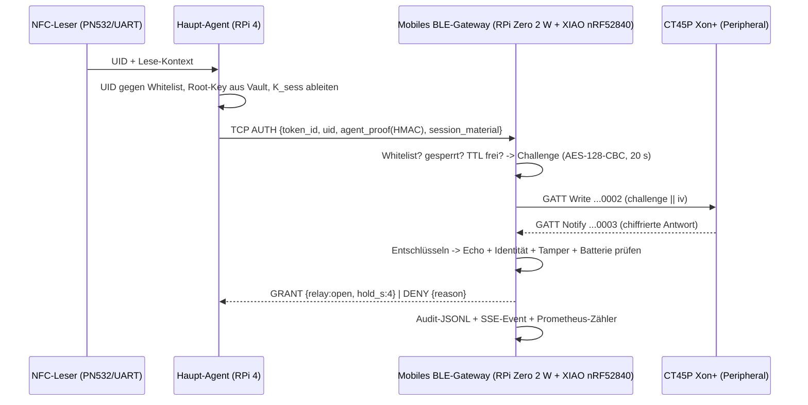

# 🔐 Mobiles BLE-Gateway — Honeywell CT45P Xon+ (Modell)

Das Gateway (`mobile-server/`) ist die Antwort auf das Datenfluss-Konzept
**NFC → Haupt-Agent → TCP → mobiler BLE-Server → Token**, korrigiert um den entscheidenden Punkt:

> Der CT45P Xon+ ist **kein Beacon, der auf `Notify` wartet**, und er sendet auch
> **keine UID per Advertisement** heraus. Er ist ein aktiver Authentifizierungsteilnehmer,
> der nur auf eine korrekt verschlüsselte Challenge antwortet.

Ein rohes Weiterreichen der NFC-UID an das Tor ist damit kein Entwurf, sondern eine
Schwachstelle. Dieses Gateway ersetzt das Relay-Modell durch ein
**dezentrales, kryptografisches BLE-Authentifizierungs-Gateway**.

---

## 1️⃣ Was implementiert ist

| Baustein | Datei | Inhalt |
|---|---|---|
| Konstanten, Pfade, Interlocks | `mobile-server/gw_config.py` | TCP-Typen, GATT-UUIDs (Annahmen!), TTL, Lockout, Whitelist-Pfad |
| Krypto + Framing | `mobile-server/honeywell.py` | Frame-Codec (MAGIC+Version+Typ+Länge+CRC32), AES-128 in reinem Python (nutzt `cryptography`, falls installiert), CBC, Key-Derivation, Challenge/Response |
| Sitzungs-Maschine | `mobile-server/gateway.py` | Whitelist, Challenges, Sperrlogik, Tamper-Auswertung, Audit-JSONL, Events, Prometheus |
| BLE-Schicht | `mobile-server/ble_adapter.py` | `mock` · `bluetoothctl` (Scan) · `gdbus` (BlueZ GATT-Peripheral) |
| Dienste + CLI | `mobile-server/mobile_ble_server.py` | TCP `:8765`, HTTP/JSON + SSE + `/metrics` auf `:8791`, `run`/`selftest`/`scan`/`simulate-token` |
| Tests | `mobile-server/tests/test_gateway.py` | 25 Prüfungen (FIPS-Vektoren, Replay, Lockout, Tamper, Codec-Härtung) |

### Korrekter Datenfluss (implementiert)



Eigenschaften, die das Design **wirklich** absichern:

- **Whitelist-Zwang.** Kein Eintrag ⇒ `DENY not_whitelisted`, auch bei gültiger Signatur.
  `auto_enroll` gibt es nur als Labor-Flag.
- **Kein Root-Key am Edge.** Das Gateway kennt nur `key_fingerprint` (SHA-256). Der abgeleitete
  Session-Key lebt ausschließlich im RAM, wird nach Abschluss verworfen und landet nie im Audit.
  Ohne Material arbeitet der **`delegated`-Modus**: Das Gateway prüft die Freigabe, der Agent
  führt die Krypto aus und meldet das Ergebnis per `COMMAND {"action":"grant"}`.
- **Einmalkennung + TTL.** 16 Byte Zufalls-Challenge, eigene IV, 20 s gültig, nach Antwort
  geschlossen → Replay derselben Antwort schlägt fehl (`unknown_or_expired_sid`). Abgelaufene
  Challenges werden aktiv bereinigt (`sweep_expired`) und als `denied: challenge_expired` gezählt.
- **Brute-Force-Sperre pro Token**, nicht pro Session (3 Fehlversuche ⇒ 120 s Sperre). Wer jede
  Lesung als neue Session tarnt, läuft in dieselbe Sperre.
- **Tamper-Auswertung.** `tamper > 0` erhöht den Zähler im Whitelist-Eintrag; ab
  `max_tamper_count` wird das Token revokiert und der Lesestatus auf `0x04` (Tamper) gesetzt.
- **Integrität auf der Leitung.** Frame-CRC32, Längenprüfung, Resync bei Müll, fester Abbruch bei
  falscher Protokollversion statt Raten.
- **Agent-Nachweis (`agent_proof`).** Geprüft wird nicht nur das Token, sondern auch, **wer** die
  Lesung anstößt: HMAC-SHA256 über `auth|<token_id>|<nonce>|<ts>` mit einem vorab ausgetauschten
  geteilten Geheimnis (PSK, **nie** der Token-Root-Key). Ohne Nachweis ⇒ `denied agent_proof_missing`;
  nach `DGS_AGENT_MAX_BAD_PROOFS` (Default 3) Fehlversuchen ist der **Agent** für
  `DGS_LOCKOUT_SECONDS` suspendiert. Warum: sonst könnte jeder, der Port 8765/8791 erreichen kann,
  Challenges auslösen, Auto-Enroll füttern und Tokens per gezielten Fehlversuch sperren.
  Modus `--require-agent-proof auto|1|0` (`auto` = prüfen, sobald `data/keys.json` existiert).
  MCP-Bridge und Desktop-Konsole signieren automatisch, sobald `DGS_AGENT_SHARED_SECRET` bzw.
  `DGS_AGENT_SECRET_FILE` gesetzt ist – im Browser landet dadurch kein Schlüsselmaterial.
  Demo-Handshake und Selbsttest laufen über denselben Nachweis-Pfad, statt ihn zu umgehen.

## 2️⃣ Starten

```bash
# Demo ohne Hardware (simuliertes Token antwortet selbst)
python3 mobile-server/mobile_ble_server.py --mock

# Selbsttest: 10 Prüfungen über echte Sockets + echte Krypto (freie Ports automatisch)
python3 mobile-server/mobile_ble_server.py selftest

# Unit-Tests (20)
python3 mobile-server/tests/test_gateway.py

# Realer Scan über USB-/Onboard-Adapter
python3 mobile-server/mobile_ble_server.py --ble-backend bluetoothctl

# Echter BlueZ-GATT-Peripheral (Root, BlueZ --experimental; Adapter muss Peripheral können)
sudo python3 mobile-server/mobile_ble_server.py --ble-backend gdbus

# Token-Gegenseite simulieren (Prüfstand): kennt den Root-Key, antwortet auf die Challenge
python3 mobile-server/mobile_ble_server.py simulate-token \
  --token-id CT45P-0001 --key 000102030405060708090a0b0c0d0e0f
```

| Port | Zweck |
|---|---|
| `:8765` | TCP für den Haupt-Agenten (Frame-Typen: `gw_config.TYPE_NAMES`) |
| `:8791` | HTTP/JSON: `/status` `/tokens` `/sessions` `/challenge` `/nfc` `/respond` `/command` `/tokens` `/whitelist` `/simulate` `/events` (SSE) `/metrics` |

Die Web-App und die Desktop-Konsole sprechen `:8791` **nicht** direkt an, sondern über die
MCP-Bridge (`/gateway/*`, siehe [docs/mcp-integration.md](mcp-integration.md)). Vorteil: im WebView
geben es keine localhost-Adressen und keine CORS-Ausnahmen.

Bequem über npm:

```bash
npm run mcp:gateway          # Mock-Gateway starten
npm run mcp:gateway:selftest # Selbsttest
npm run mcp:gateway:tests    # Unit-Tests
npm run dev:full             # Vite + Bridge + Gateway
```

## 3️⃣ HTTP/JSON-API (Auszug)

```bash
curl -s localhost:8791/status  | jq '.metrics, .ble.gatt'
curl -s localhost:8791/tokens  | jq '.tokens[] | {token_id, zone, revoked, locked}'

# NFC-Lesung anmelden (ohne Material => delegated)
curl -s -X POST localhost:8791/nfc \
  -d '{"token_id":"CT45P-0001","uid":"04:A2:B3:C1:D2:E3"}'

# Vollständiger Handshake (Material nur über Loopback/TLS!)
curl -s -X POST localhost:8791/nfc -d '{
  "token_id":"CT45P-0001",
  "uid":"04:A2:B3:C1:D2:E3",
  "session_material":"000102030405060708090a0b0c0d0e0f",
  "agent_proof":{"nonce":"…","ts":1788916198,"mac":"…"}
}'

curl -s -X POST localhost:8791/command -d '{"action":"demo_handshake"}'
curl -s -X POST localhost:8791/command -d '{"action":"whitelist_revoke","token_id":"CT45P-0002"}'
curl -s -X POST localhost:8791/whitelist -d '{"token_id":"CT45P-0009","zone":"Werks2/Halle3"}'
```

Whitelist: `mobile-server/data/whitelist.json` (beim ersten Start automatisch angelegt).
Ein leerer `key_fingerprint` bedeutet „ungeprüft, aber freigegeben“; ist er gesetzt, muss die
Antwort des Tokens denselben Fingerabdruck haben. Im Mock-Modus wird ein leeres Feld bei
erfolgreicher Prüfung mit dem Fingerabdruck des simulierten Tokens gefüllt, damit ein Replays
gegen ein anderes Token fehlschlägt.

Wichtige `DENY`-Gründe: `no_request`, `not_whitelisted`, `revoked`, `token_locked`,
`missing_token_id`, `unknown_token`, `unknown_or_expired_sid`, `response_too_short`,
`decryption_failed`, `wrong_challenge_echo`, `token_mismatch`, `key_mismatch`, `tamper_detected`.

## 3️⃣b Schlüsselverwaltung (`keys.json`)

| Datei | Ort | Inhalt | Regel |
|---|---|---|---|
| `keys.json` | **Haupt-Agent** (RPi 4) / Vault | `shared_secret` (PSK) + `tokens[].root_key` (AES-128 je Token) + optionale `uid`-Zuordnung | `chmod 600`, nie committen |
| `data/keys.json` | **Gateway** (RPi Zero 2 W) | **nur** `shared_secret` | `chmod 600`, nie committen |
| `data/whitelist.json` | Gateway | `token_id`, `zone`, `roles`, `key_fingerprint` (SHA-256, 4er-Gruppen) | versionierbar – enthält keine Schlüssel |

```bash
# Erzeugen (Root-Key + PSK, Dateirechte 0600)
python3 mobile-server/honeywell_keys.py create --keys /etc/dingelschwing/keys.json --token-id CT45P-0001

# Whitelist-Datensatz für das Gateway ableiten (nur Fingerabdrücke, keine Keys)
python3 mobile-server/honeywell_keys.py whitelist --keys /etc/dingelschwing/keys.json \
  > mobile-server/data/whitelist.json

# Gegenprüfen / einzelnen Leselauf anstoßen
python3 mobile-server/honeywell_keys.py fingerprints --keys /etc/dingelschwing/keys.json
python3 mobile-server/honeywell_keys.py trigger --keys /etc/dingelschwing/keys.json \
  --token-id CT45P-0001 --uid 04:A2:B3:C1:D2:E3 --url http://127.0.0.1:8791/nfc
```

Das Fingerabdruck-Format wird aus `honeywell.token_key_fingerprint` delegiert, damit Agent und
Gateway nie an einer Darstellung scheitern. Vorlage: `mobile-server/keys.example.json`.

### Prüfhelfer ohne proprietäre Token-Firmware

```bash
# NFC-Seite: UID vorzeigen, Challenge auslösen (mit --respond auch sofort beantworten = Prüfstand)
python3 mobile-server/nfc_reader.py present --uid 04:A2:B3:C1:D2:E3 --respond
python3 mobile-server/nfc_reader.py watch --reader pn532://--tty=/dev/serial0      # nfcpy nötig
python3 mobile-server/nfc_reader.py present --uid 04A2B3C1D2E3 --dry-run           # kein Netzwerk

# Token-Seite: Challenge/Response über HTTP (identische Krypto wie per BLE-Notify)
python3 mobile-server/bleak_token.py relay --url http://127.0.0.1:8791 --token-id CT45P-0001 --key <32hex>
python3 mobile-server/bleak_token.py replay-check --url http://127.0.0.1:8791 --token-id CT45P-0001 --key <32hex>
python3 mobile-server/bleak_token.py crypto-check --key <32hex>
python3 mobile-server/bleak_token.py gatt-scan --timeout 6
```

`bleak_token.py` ist **Simulator/Prüfstand**, kein einsetzbares Token: Es stellt die Gegenseite dar,
damit Whitelist, TTL, Lockout, Agent-Nachweis und Audit ohne Hardware prüfbar bleiben. `bleak`
kann kein GATT-Peripheral betreiben – für echtes Advertising nutzt die Gegenseite BlueZ
(`--ble-backend gdbus`, Vorlage `ble_adapter.py`). `replay-check` erwartet `✅ erste antwort akzeptiert`,
`✅ replay abgelehnt (unknown_or_expired_sid)` und `✅ falscher schluessel abgelehnt`.

---

## 4️⃣ HW-Beschaltung (Haupt-Agent RPi 4 + mobiler RPi Zero 2 W)

```text
┌──────────────────── RPi 4 (Haupt-Agent) ────────────────────┐
│ PN532 (UART) ──┐                                            │
│               ├─ Agent-Prozess: Whitelist, K_sess, TCP-Client
│ Vault/ENV ────┘        │                                     │
└────────────────────────┼────────────────────────────────────┘
                         │ TCP :8765 (Frame „DGS1“, LAN/VPN)
┌────────────────────────▼────────────────────────────────────┐
│ RPi Zero 2 W  –  mobiles BLE-Gateway                        │
│  USB/BT-Adapter oder XIAO nRF52840 (USB-CDC, HCI)           │
│  BlueZ 5.6x --experimental → GattManager1 (Peripheral)      │
│  HTTP :8791 für UI/Bridge, Audit nach mobile-server/data/   │
└────────────────────────┬────────────────────────────────────┘
                         │ BLE 2.4 GHz, GATT (proprietär)
                  ┌──────▼───────┐
                  │ CT45P Xon+   │  ← antwortet nur auf korrekte Challenge
                  └──────────────┘
```

Checkliste für den Zero 2 W:

```bash
sudo apt install bluez libglib2.0 python3-gi gir1.2-glib-2.0
sudo hciconfig hci0 up
bluetoothctl show | grep -i "Modalias\|Manufacturer"   # Adapter alive?
python3 -c "import gi; print('gdbus bereit')"          # PyGObject für GattManager1
```

XIAO nRF52840 alternativ als reiner HCI-Dongle bespielen (`nrfutil`/`west flash` mit
`usb_rx_tx`-HCI-Bild), dann verhält er sich wie ein normaler Bluetooth-Adapter. `bluetoothctl`
und `gdbus` funktionieren unverändert.

## 4️⃣b PortView & Software-Grabber am Gateway

Der Gateway-Prozess beantwortet zusätzlich PortView-Broadcasts (UDP `:18791`,
abzuschalten mit `--no-discover`, Metrik `dingelschwing_gateway_portview_answers`)
und betreibt den Software-Grabber (`GET /imports`, `POST /import`, `GET /import/file/<id>`,
abzuschalten mit `--no-import`). Beide Funktionen gehören zur Zugangskette dazu –
PortView ersetzt das manuelle Eintippen einer Adresse an der Handheld-Konsole, der
Grabber liefert Audiomaterial, UI-Styles und Filter auf das Gerät.

Einzelheiten (UDP-Payload, SSRF-Filter, Größen-/Zeitgrenzen, Dedupe, App-Integration,
Android-Berechtigungen) stehen in [`docs/portview-import.md`](portview-import.md).

## 5️⃣ ⚠️ Rechtlicher & technischer Rand

1. **Proprietäres Protokoll.** Honeywell dokumentiert Dienst-UUIDs, Charakteristiken und das
   Response-Format des CT45P Xon+ **nicht** öffentlich. Die hier verwendeten UUIDs
   (`6E400001-B5A3-F393-E0A9-E50E24DCCA9F`-Familie), das 28-Byte-Antwortformat und die
   Derivation `K_sess = HMAC-SHA256(K_root, "dgs-ct45p-v1|<token_id>|<challenge>")[:16]`
   sind **explizit als Annahmen markiert** (angelehnt an Nordic UART Service + gängige
   Industrie-Muster). `gw_config.py` und `honeywell.py` tragen entsprechende Warnkommentare.
2. **Vor dem Feldeinsatz** zwingend: Dienste/Charakteristiken mit nRF Connect/LightBlue gegen ein
   reales Token auslesen, UUIDs in `gw_config.py` ersetzen, Antwortformat in
   `honeywell.parse_response_plaintext()` nachziehen. Whitelist, TTL, Lockout, Nachweis, Audit und
   Metriken bleiben unverändert gültig.
3. **Zugangskontrolle ist sicherheitskritisch.** Das Modell ist für Labor, Aufbau und Audit
   gedacht. Es ersetzt keine zertifizierte Leser-/Controller-Kette und kein Freigabeverfahren des
   Anlagenbetreibers. Manipulation an Zugangskontrollsystemen ohne schriftliche Genehmigung ist
   rechtswidrig.
4. **`session_material` nur über Loopback oder TLS.** Sonst fließt Schlüsselmaterial im Klartext
   über TCP — in Produktion nur `localhost` oder VPN/WireGuard.

## 6️⃣ Reverse-Engineering-Fahrplan

| Schritt | Werkzeug | Ergebnis |
|---|---|---|
| 1. Dienstrekonstruktion | `bluetoothctl` / nRF Connect | echte Service-/Char-UUIDs, Flags, MTU |
| 2. Verkehrsaufnahme | nRF Sniffer for BLE 5.x (alternativ Ubertooth) | PDU-Sequence `AUTH → CHALLENGE → RESPONSE` |
| 3. Struktur lernen | `honeywell.py` anpassen | Feldlängen, Prüfbytes, Zählerpositionen |
| 4. Krypto prüfen | KAT mit bekanntem Schlüssel | Modus (CBC/CTR), Polsterung, Derivation |
| 5. Härtung | `tests/test_gateway.py` erweitern | Replay-/Truncation-/Lockout-Fälle fürs reale Format |

Für Schritt 2–4 ist ein **autorisiertes Test-Token** nötig; Auswertung offline, niemals im laufenden
Produktivbetrieb einer Zugangskontrollanlage.
