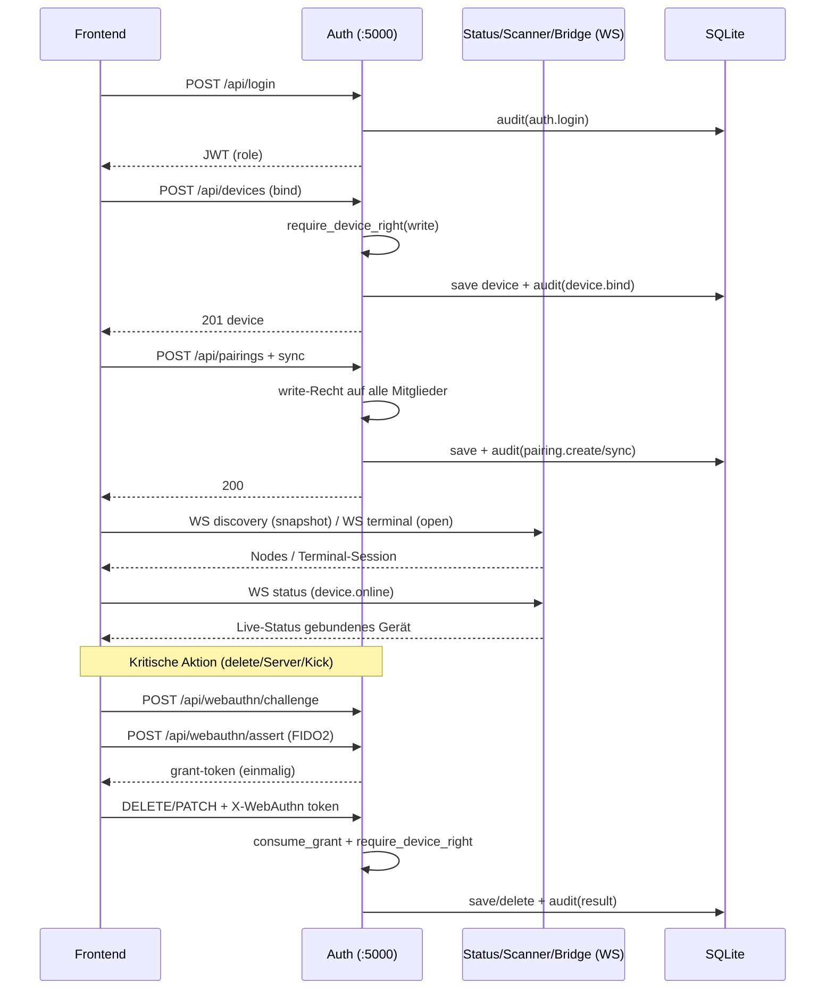
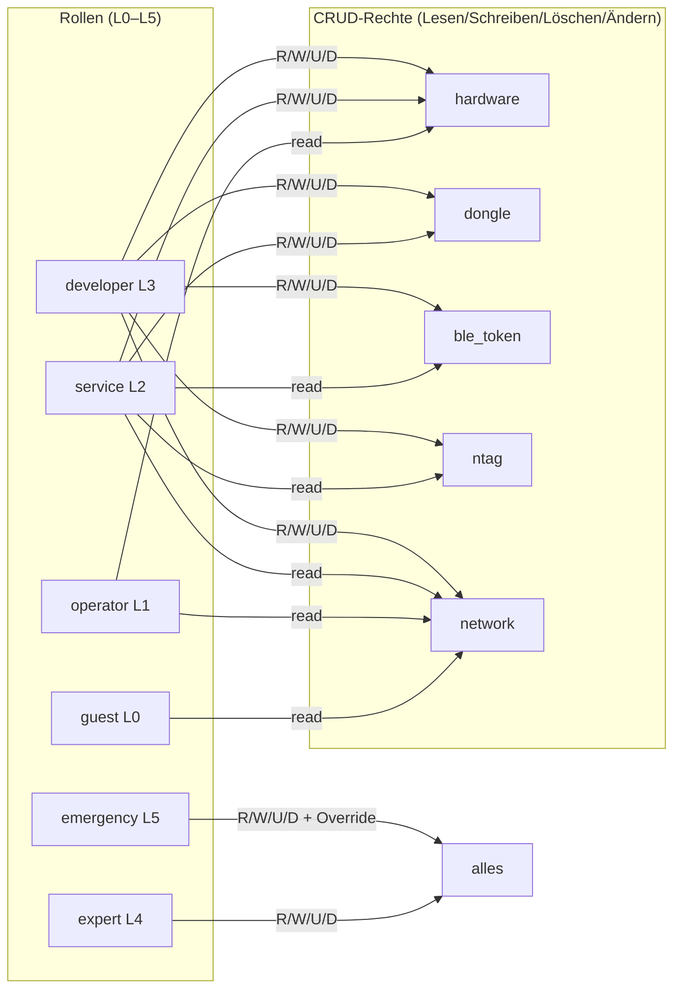
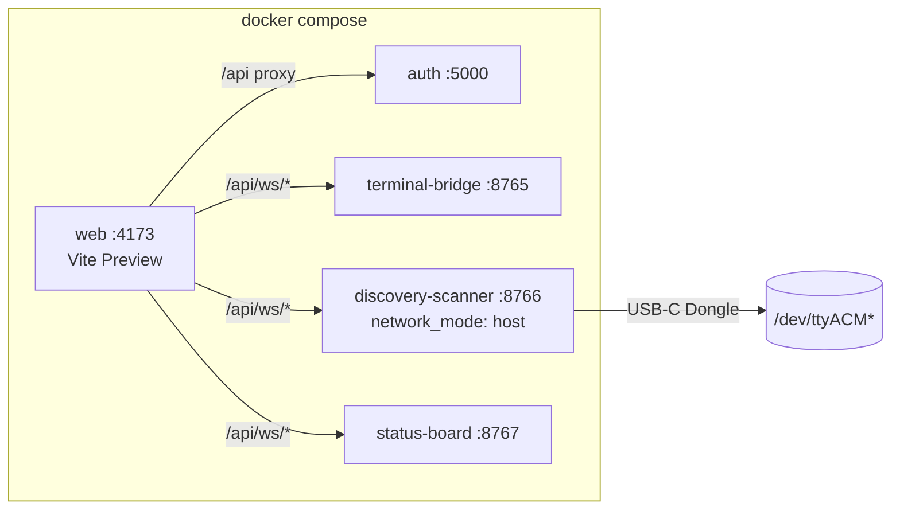

# HackGPT-CPS — Architektur-Diagramme

**NEXUS-BUILDER v2.3** · Alle Diagramme sind Mermaid (rendert in GitHub/VS-Code/Markdown-Viewer mit Mermaid-Support). Die Live-Preview in Arena zeigt Mermaid als gerendertes Diagramm.

---

## 1. System-Überblick (Komponenten & Dienste)

```mermaid
flowchart TB
    subgraph Browser["Browser (Frontend: React + Vite :5173)"]
        UI[AccessConsole / OverviewPanel / NetworkPanel / PairingPanel / StatusBoard / Terminal]
        DISP[useDiscovery · useStatusBoard · useTerminal]
        ERR[Error-Hierarchie + Backoff + CircuitBreaker]
    end

    subgraph Server["Backend (Python)"]
        AUTH[Flask Auth :5000<br/>JWT · RBAC · CRUD · Pairing · Audit]
        BRIDGE[Terminal-Bridge :8765<br/>WS + PTY/SSH]
        SCAN[Discovery-Scanner :8766<br/>mDNS/SSDP/BLE + USB-Dongle]
        STATUS[Status-Board :8767<br/>Live-Präsenz + Device-Status]
        AUDIT[Audit-Trail (SQLite)]
        DB[(SQLite<br/>devices/clients/pairings/audit/users/webauthn)]
        WB[WebAuthn :5000<br/>FIDO2-Registrierung + ECDSA-Assertion]
        USERS[Nutzer-DB<br/>PBKDF2-Hashes (werkzeug)]
    end

    subgraph HW["Hardware / Netzwerk"]
        DONGLE[USB-C-Dongle]
        BLE[BLE-Token / NTag]
        NET[Netzwerkgeräte / WiFi]
    end

    UI --> AUTH
    DISP -->|wss| BRIDGE
    DISP -->|wss| SCAN
    DISP -->|wss| STATUS
    UI --> WB
    AUTH --> AUDIT
    AUTH --> DB
    AUTH --> USERS
    AUDIT --> DB
    BRIDGE --> DB
    BRIDGE --> DONGLE
    BRIDGE --> NET
    SCAN --> BLE
    SCAN --> DONGLE
    SCAN --> NET
    STATUS --> AUTH
```

---

## 2. Aktionskette (End-to-End, nachvollziehbar)



---

## 3. RBAC & CRUD-Rechtematrix



---

## 4. Fehlerresilienz (Modul 6)

```mermaid
flowchart LR
    subgraph Client["Client (Browser)"]
        C1[Error-Hierarchie AppError]
        C2[toUserMessage → UI]
        C3[Exponential Backoff]
        C4[Circuit Breaker]
        C5[Idle-Timeout]
    end
    subgraph Netz["Netzwerk"]
        N1[WS-Reconnect mit Backoff]
        N2[Stale-Removal TTL]
    end
    subgraph Server["Server"]
        S1[Global Error-Handler 400/401/403/404/500]
        S2[Eingabe-Validierung]
        S3[WebAuthn (FIDO2, wa_token) + RBAC-Guard]
        S4[Audit-Trail trace_id]
    end
    C1 --> C2
    C3 --> N1
    C4 --> N1
    N1 --> S1
    S1 --> S2
    S2 --> S3
    S3 --> S4
```

---

## 5. Infrastruktur (Docker Compose)


